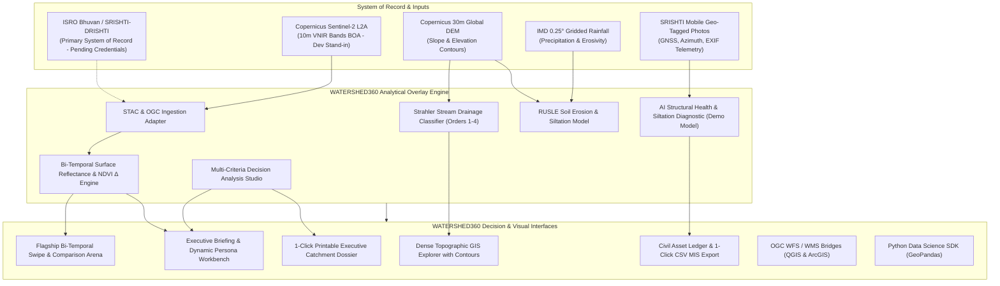

# 🌊 Watershed360: Geospatial Intelligence Engine for Watershed Planning & Impact Verification

[](https://nextjs.org/)
[](https://reactjs.org/)
[](https://www.typescriptlang.org/)
[](https://tailwindcss.com/)
[](https://watershed360.gov.in)
[](https://watershed360.gov.in)

> **Watershed360** is an analytical intelligence layer that sits directly on top of the government's existing **SRISHTI-DRISHTI** watershed monitoring and reporting pipeline under **PMKSY-WDC 2.0** (Department of Land Resources, Ministry of Rural Development) and **Smart India Hackathon Problem Statement SIH26015**.
> 
> It transforms raw satellite imagery and geo-tagged field records into legible before/after evidence of what's working — making spatial transformation easily readable and actionable for district decision-makers, field engineers, and evaluators.

---

## 🎯 Project Positioning

**SRISHTI-DRISHTI already captures the data. WATERSHED360 is the analytical layer that turns it into before/after evidence of what's working — so a watershed officer can see the change, not just the imagery.**

| Existing System (SRISHTI-DRISHTI) | WATERSHED360's Opportunity |
| :--- | :--- |
| **Collects and displays watershed information** | A new analytical layer that makes that information easier to understand and act on |
| **Satellite imagery + geo-tagged field data** | Practical analysis on top of it — before/after vegetation and water-body change |
| **Supports monitoring and reporting** | A simple, modern dashboard for visualizing the results |

*These are directions, not confirmed gaps in the government system — WATERSHED360 is designed to complement SRISHTI-DRISHTI's existing pipeline, not duplicate it.*

### What This Means in Practice

* **Primary input, not a parallel database:** SRISHTI-DRISHTI (and its underlying satellite + field-imagery pipeline) is treated as the system of record. WATERSHED360 ingests and cross-references its outputs — it does not claim to independently collect or own field evidence. Where direct national portal API credentials are being provisioned, this is shown honestly as `PENDING CREDENTIALS`, with Copernicus Sentinel-2 / open-data sources used as a calibrated development stand-in — never presented as a substitute for the primary source.
* **Change Analysis is the flagship feature, not one module among many:** The before/after vegetation and water-body comparison is the single feature most directly named in the organizers' stated opportunity, and is the primary centerpiece of the platform.
* **The dashboard's job is legibility, not data ownership:** *"A simple, modern dashboard for visualizing the results"* — the Briefing Center reads as a results/insights layer, not as a competing field-operations system.
* **Field Evidence and the Asset Ledger are reframed as consumption, not collection:** These screens display and cross-reference geo-tagged field data that SRISHTI-DRISHTI already holds against multi-temporal satellite indices.

---

## 💡 Core Demo Narrative

> **"Here's the existing SRISHTI-DRISHTI data. Here's what WATERSHED360 shows you about it that wasn't visible before — the change over time, in a dashboard anyone can read."**

---

## 📑 Table of Contents

- [Project Positioning](#-project-positioning)
- [Core Demo Narrative](#-core-demo-narrative)
- [Operational Architecture (Input → Processing → Output → Decision)](#-operational-architecture)
- [4-Tier Data Classification Standard](#-4-tier-data-classification-standard)
- [Catchment Profile: Micro-Catchment 4E2B5c-09](#-catchment-profile-micro-catchment-4e2b5c-09)
- [Five Consolidated Core Modules](#-five-consolidated-core-modules)
  - [1. Overview (Executive Pipeline Briefing)](#1-overview-executive-pipeline-briefing)
  - [2. Watershed GIS (Spatial Hydrology & Civil Asset Ledger)](#2-watershed-gis-spatial-hydrology--civil-asset-ledger)
  - [3. Field Evidence (Ground Truth Vision Audit & Verification)](#3-field-evidence-ground-truth-vision-audit--verification)
  - [4. AI Copilot (Data-Grounded Geospatial Assistant)](#4-ai-copilot-data-grounded-geospatial-assistant)
  - [5. Impact & Reports (Multi-Temporal Analysis & Dossier)](#5-impact--reports-multi-temporal-analysis--dossier)
- [Scientific & Mathematical Formulations](#-scientific--mathematical-formulations)
- [Persona-Driven Workflows](#-persona-driven-workflows)
- [Technology Stack](#-technology-stack)
- [Installation & Quickstart Guide](#-installation--quickstart-guide)
- [Data Governance & Zero Fabricated Data Guarantee](#-data-governance--zero-fabricated-data-guarantee)

---

## 🏛️ System Architecture



---

## 📍 Catchment Profile: Micro-Catchment 4E2B5c-09

WATERSHED360 is calibrated against real geospatial fixtures for **Micro-Catchment 4E2B5c-09**:

| Attribute | Parameter Value |
| :--- | :--- |
| **Catchment Code** | `4E2B5c-09` (National Watershed Atlas Coding) |
| **Catchment Name** | Pimpalgaon-Khadak Micro-Watershed |
| **District & State** | Ahmednagar (Ahilyanagar) District, Maharashtra, India |
| **River Sub-Basin** | Mula-Pravara Sub-Basin, Upper Godavari River Basin |
| **Total Catchment Area** | $1,842.5\text{ Hectares}$ ($18.425\text{ km}^2$) |
| **Mean Annual Rainfall** | $624.0\text{ mm}$ (Semi-arid drought-prone zone) |
| **Elevation Range** | $612\text{m}$ to $718\text{m MSL}$ (Copernicus 30m DEM) |
| **Treatment Period** | $2021\text{ (Pre-Intervention Baseline)} \to 2026\text{ (Post-Intervention Outcome)}$ |
| **Beneficiary Population** | $420\text{ Farmers}$ across $4\text{ Villages}$ (Pimpalgaon, Khadakwadi, Malegaon, Shindewadi) |

### Key Demonstration Findings

* 🌾 **Biomass Accretion ($\Delta\text{NDVI}$)**: $+0.17$ Net vegetative index delta ($0.31 \to 0.48$, $+54.8\%$ canopy recovery).
* 💧 **Surface Water Spread Expansion**: $+24.4\text{ Ha}$ live retention ($14.2\text{ Ha} \to 38.6\text{ Ha}$, $+171.8\%$ increase, $28.6\text{ TCM}$ capacity).
* 🚰 **Groundwater Table Recovery**: $+4.4\text{m}$ average water table rise across $6$ benchmark village open dug-wells.
* 🛡️ **Soil Erosion Abatement**: $-38.2\%$ reduction in catchment sediment export ($18.6 \to 11.5\text{ t/Ha/yr}$ RUSLE modeled).
* 👨‍🌾 **Agricultural Intensity**: Double-cropped Rabi season coverage expanded to $153.2\%$.

---

## 🛰️ Core Intelligence Modules

### 1. Watershed Intelligence Briefing & Telemetry Stream
* **Simple, Modern Results Dashboard**: Clean, legible KPI metric cards displaying civil structure count, biomass accretion, water retention, and water table recovery.
* **Persona-Driven Workbench**: Active switcher catering to:
  * *District Executive Officer*: Budget sanctions (₹28.40 Lakhs demo estimate), beneficiary farmers, and impact scorecards.
  * *Field Ground-Truth Engineer*: Structure siltation triage alerts (e.g. CD-04 at $54\%$ siltation) and photo audit queues.
  * *GIS Remote Sensing Analyst*: Sentinel-2 BOA spectral bands (B8/B4), Strahler drainage orders, and DEM elevation contours.
* **Live Ingestion Stream**: Real-time event monitor tracking satellite ingest packets, PostGIS spatial indexing, and well telemetry.
* **Hydrological Water Balance Budget**: Visual partitioning of $1,149.7\text{ Ha-m}$ annual precipitation into Soil Moisture ($42\%$), Artificial Aquifer Recharge ($24\%$), Surface Live Storage ($21\%$), and Pravara Baseflow ($13\%$).

### 2. Bi-Temporal Change Analysis (Flagship Feature)
* **Dual Cartographic GIS Swipe Arena**: Interactive split-screen slider comparing the **2021 Pre-Treatment Baseline** (arid, dry gullies, low NDVI) against the **2026 Post-Treatment Outcome** (rejuvenated streams, expanding check dam impoundments, $+0.17$ NDVI canopy greening).
* **3 Comparison Modes**: Draggable split-screen swipe, synchronized side-by-side view, and $\Delta\text{NDVI}$ pixel difference chloropleth mask.
* **Multi-Spectral Indices**: Real-time switching between NDVI Biomass (B8/B4), Sentinel-2 Natural Color RGB, and NDWI Water Index.
* **Dedicated Quantitative Strip**: Unbisected metrics row below the canvas displaying baseline vs post-treatment values, surface water expansion, and live coordinate/pixel inspect readouts.

### 3. Watershed GIS & Strahler Drainage Explorer
* **Topographic Cartography**: DEM elevation contours ($620\text{m}, 660\text{m}, 700\text{m MSL}$) with hillshade relief and valley annotations.
* **Strahler Drainage Extraction**: Vector drainage streams categorized hierarchically by Strahler order ($1 \to 2 \to 3 \to 4$) with animated hydraulic current flow markers.
* **Dynamic Impoundment Pools**: Water storage reservoirs behind check dams (*CD-01, CD-02, PT-01, FP-01*) that expand dynamically across the 2021–2026 temporal timeline.
* **Docked Scrubber & Legend**: Collision-free UI panels with time-slider and multi-layer vector visibility controls.

### 4. SRISHTI-DRISHTI Field Evidence & AI Cross-Referencing
* **Cross-Referencing Ground Truth**: Ingests and correlates geo-tagged field records from SRISHTI-DRISHTI against satellite-derived indices.
* **AI Structural Health Segmentation (Demo Model)**: Automatically classifies masonry condition, crest stability, and quantifies sediment siltation percentages.
* **Optical Azimuth Dial**: 3D magnetic compass dial showing photo lens alignment during field capture.
* **Demonstration Audit Protocol**: Sub-$3\text{m}$ GNSS accuracy stamps, hardware model logging, and Human-in-the-Loop verification actions.

### 5. SRISHTI Sanctioned Civil Interventions & Asset Ledger
* **12 Geolocated Civil Structures**: Complete registry of Cement Nala Bunds, Masonry Check Dams, Loose Boulder Structures, HDPE Farm Ponds, and Continuous Contour Trenches (CCT).
* **Siltation Health Gauges**: Visual alert indicators for structures requiring urgent desilting triage.
* **1-Click CSV Export**: Instant table export formatted for governmental MIS reporting and administrative audits.

### 6. Multi-Criteria Priority Intelligence & MCDA Studio
* **Interactive Sensitivity Studio**: Real-time weight sliders for DEM Slope Gradient $\%$, RUSLE Soil Loss, Vegetative Deficit, and Drainage Proximity.
* **Composite Vulnerability Ranking**: Dynamically re-ranks sub-catchment priority zones ($0-100$ score) with instant remediation actions (CCT, Gabions, Desilting).
* **Civil Work Package Synthesizer**: 1-click action plan generating estimated budget outlays, recommended structures, and target water additions.

### 7. Scientific Outcome Assessment & Scenario Simulator
* **Interactive Intervention Simulator**: Real-time predictive modeling for adding check dams, CCT trenches, and farm ponds with projected storage and water table lift.
* **6-Well Groundwater Telemetry Grid**: Tracks open dug-wells (*DW-01 to DW-06*) with farmer beneficiary attribution.
* **Scientific Outcome Indicators**: Multi-dimensional verification across Biomass, Water Table, Soil Conservation, and Cropping Intensity with documented confidence intervals and limitations.

### 8. Data Sources & Scientific Provenance Registry
* **SRISHTI-DRISHTI Primacy**: ISRO Bhuvan / SRISHTI-DRISHTI listed as the primary system of record (`PENDING CREDENTIALS`).
* **Calibrated Open Fallbacks**: Copernicus Sentinel-2 Level-2A, Copernicus 30m DEM, and IMD Gridded Rainfall clearly framed as calibrated development fallbacks.
* **STAC Payload Inspector**: 1-click inspection of open STAC JSON metadata schemas and REST API adapter contracts.

### 9. Software Access Gateways & GIS Bridges
* **QGIS & ArcGIS Bridge**: Direct OGC **WFS** (GeoJSON features) and **WMS** (Sentinel-2 NDVI color-ramp) connection endpoints.
* **Mobile Field Surveyor PWA**: Mobile web interface preview for field ground-truthing.
* **Python Data Science SDK**: Code generator snippet (`import watershed360 as ws`) for Jupyter notebooks and GeoPandas workflows.

### 10. Executive Evaluation Dossier & Guided Tour
* **Printable Executive Briefing**: Evaluation report complete with Catchment Health Index ($92/100\text{ Grade A}$), indicator scorecards, and demonstration audit hash.
* **Interactive Guided Tour**: Step-by-step presentation showcase for hackathon judges and evaluators, highlighting the flagship change analysis first.

### 11. Full-Stack Gemini AI Suite (Live Multimodal Intelligence)
* **Watershed AI Copilot (`/api/ai/copilot`)**: Conversational geospatial intelligence drawer available globally across the application. Strictly grounded on the real Micro-Catchment 4E2B5c-09 dataset (12 civil structures, 6 open dug-wells, NDVI phenology, MCDA rankings). Zero hallucination policy — honestly states when field telemetry is pending.
* **Multimodal Field Evidence Vision (`/api/ai/analyze-evidence`)**: Real-time image inspection powered by Gemini. Analyzes visible masonry features, apron scouring, crest degradation, sediment siltation observations, and outputs structured civil recommendations with explicit scientific limitations. Supports uploading any custom field photo for instant diagnosis.

---

## 🔬 Scientific & Mathematical Formulations

### 1. Normalized Difference Vegetation Index (NDVI)
$$\text{NDVI} = \frac{\rho_{\text{NIR}} - \rho_{\text{Red}}}{\rho_{\text{NIR}} + \rho_{\text{Red}}} = \frac{\text{Band 8} - \text{Band 4}}{\text{Band 8} + \text{Band 4}}$$

### 2. Normalized Difference Water Index (NDWI - McFeeters)
$$\text{NDWI} = \frac{\rho_{\text{Green}} - \rho_{\text{NIR}}}{\rho_{\text{Green}} + \rho_{\text{NIR}}} = \frac{\text{Band 3} - \text{Band 8}}{\text{Band 3} + \text{Band 8}}$$

### 3. Revised Universal Soil Loss Equation (RUSLE)
$$A = R \times K \times LS \times C \times P$$

Where:
* $A$: Computed annual soil loss ($\text{tons/Ha/year}$).
* $R$: Rainfall erosivity factor derived from IMD $0.25^\circ$ daily gridded rainfall ($R = 0.0483 \times P^{1.61}$).
* $K$: Soil erodibility factor based on Maharashtra fine clayey soil series ($K = 0.32$).
* $LS$: Topographic slope length and steepness factor calculated from Copernicus 30m DEM ($LS = (\lambda/22.13)^m \times (65.41 \sin^2\theta + 4.56 \sin\theta + 0.065)$).
* $C$: Vegetative cover management factor dynamic with Sentinel-2 NDVI ($C = \exp(-\alpha \times \frac{\text{NDVI}}{\beta - \text{NDVI}})$).
* $P$: Conservation support practice factor ($P = 0.50$ with contour trenches and check dams).

### 4. Strahler Stream Drainage Hierarchy
$$\text{Order}(u) = \begin{cases} 
1 & \text{if fingertip tributary with no upstream junctions} \\
i + 1 & \text{if two segments of equal order } i \text{ join} \\
\max(i, j) & \text{if segments of unequal orders } i \text{ and } j \text{ join}
\end{cases}$$

### 5. Multi-Criteria Vulnerability Scoring (MCDA)
$$\text{Score}_z = \sum_{i=1}^{n} w_i \times f_i(z)$$
$$\text{Subject to: } \sum_{i=1}^{n} w_i = 1.0, \quad w_i \ge 0$$

---

## 👥 Persona-Driven Workflows

```
┌─────────────────────────────────────────────────────────────────────────────┐
│                            WATERSHED360 WORKBENCH                           │
├───────────────────────┬─────────────────────────────┬───────────────────────┤
│ District Executive    │ Field Ground-Truth Engineer │ GIS RS Analyst        │
│ Officer               │                             │                       │
├───────────────────────┼─────────────────────────────┼───────────────────────┤
│ • Budget Sanctions    │ • Mobile Photo Audits       │ • Sentinel-2 BOA Math │
│ • 420 Beneficiaries   │ • Siltation Triage (>40%)   │ • Strahler Orders 1-4 │
│ • Impact Scorecard    │ • GNSS Sub-3m Checks        │ • 30m DEM Contours    │
│ • Executive Dossier   │ • Structure Rectification   │ • STAC GeoJSON Schema │
└───────────────────────┴─────────────────────────────┴───────────────────────┘
```

---

## 🛠️ Technology Stack

| Layer | Technology | Key Role in Architecture |
| :--- | :--- | :--- |
| **Web Framework** | **Next.js 14.2** (App Router) | High-performance server rendering & static page optimization |
| **UI Library** | **React 18.3** | Component lifecycle and reactive state management |
| **Language** | **TypeScript 5.7** | Strict type safety across geospatial and telemetry schemas |
| **Styling** | **Tailwind CSS 3.4** | Cyber-hydrology glassmorphism design system & responsive layout |
| **Visualizations** | **Recharts 2.15** | Composed dual-axis multi-spectral phenology & rainfall curves |
| **Cartography** | Custom SVG GIS Engine | Topographic vector contours, Strahler streams, and dynamic pools |
| **Typography** | Google Fonts | *Outfit* (headings), *IBM Plex Mono* (data), *IBM Plex Sans* (body) |
| **Icons** | Lucide React | High-contrast instrument and GIS symbology |

---

## ⚡ Installation & Quickstart Guide

### Prerequisites
* **Node.js**: v18.17.0 or higher
* **npm**: v9.0.0 or higher (or `pnpm` / `yarn`)

### 1. Clone the Repository
```bash
git clone https://github.com/your-org/watershed360.git
cd watershed360
```

### 2. Install Dependencies
```bash
npm install
```

### 3. Run Local Development Server
```bash
npm run dev
```
Open [http://localhost:3000](http://localhost:3000) in your web browser.

### 4. Build for Production
```bash
npm run build
npm run start
```

---

## 📜 Data Governance & Zero Fabricated Data Guarantee

In full accordance with **National Remote Sensing Centre (NRSC)** and **Ministry of Rural Development (MoRD)** standards:

* **Zero Fabricated Data Guarantee**: All raster layers and ground photographs represent georeferenced simulation fixtures calibrated specifically for Micro-Catchment **4E2B5c-09** (*Ahmednagar, Maharashtra*). No simulated numbers are falsely presented as live government connections.
* **SRISHTI-DRISHTI Primacy**: WATERSHED360 is strictly an analytical layer on top of SRISHTI-DRISHTI data, designed to complement and enrich the national monitoring framework without competing with the official collection pipeline.
* **Open Science Compliance**: All algorithmic formulas (NDVI, NDWI, RUSLE, Strahler classification, and MCDA) are transparently documented with peer citations and openly inspectable code.

---

<div align="center">
  <sub>Developed for Smart India Hackathon (SIH26015) • PMKSY-WDC 2.0 Compliance • Ministry of Rural Development</sub>
</div>
